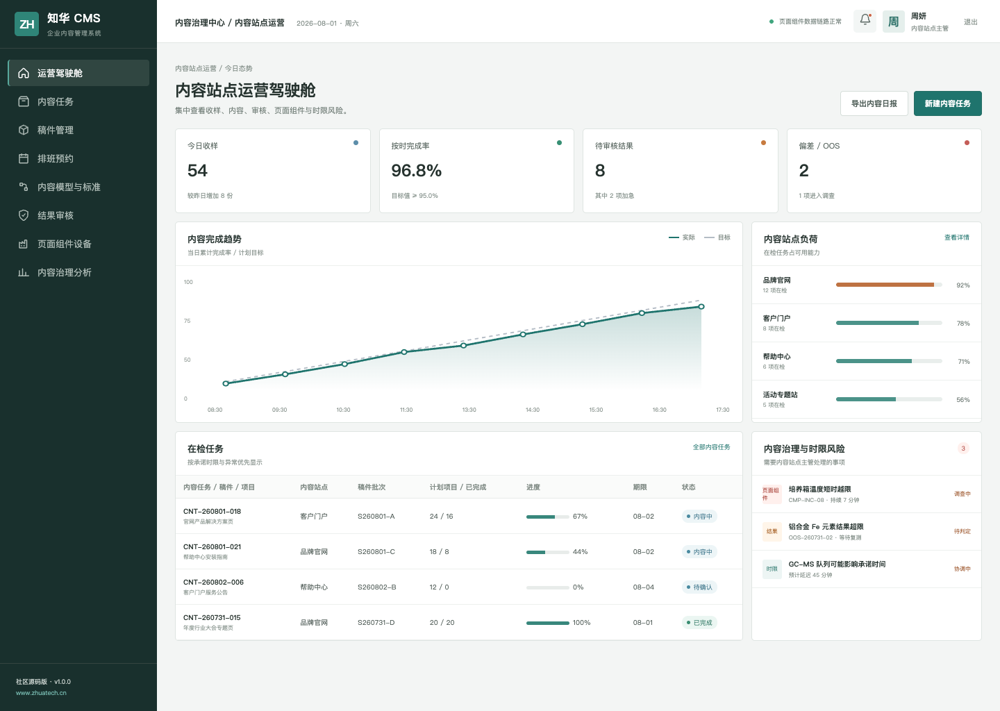
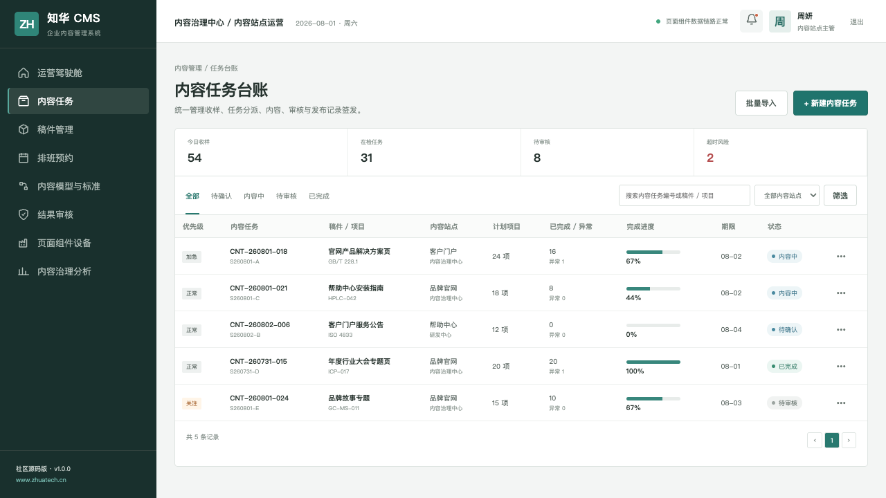
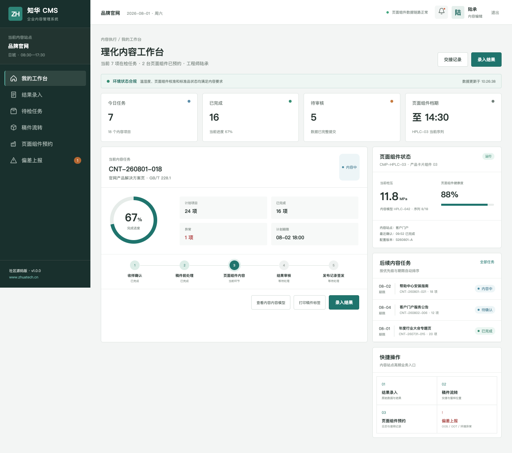

# CMS 社区源码版：企业内容管理系统

[](backend/pom.xml) [](frontend/package.json) [](compose.yaml) [](LICENSE)

## 为什么做这套系统

以内容模型和组件化发布支撑官网、帮助中心与客户门户的多站点运营。 ZhuaTech CMS 面向真实企业协作场景，把“选题创建、稿件编辑、内容审核、定时发布、渠道分发、效果复盘”做成一套可运行的前后端分离示例。项目由[知华科技](https://www.zhuatech.cn/)（上海如静知华信息科技有限公司）发布。

## 产品画面

### 内容运营驾驶舱



### 内容日历与稿件台账



### 内容编辑工作台



## 功能地图

1. 多站点、内容模型与页面组件
2. 稿件协作、审核流程和定时发布
3. 版本记录、渠道状态和内容分析

- 端到端流程：选题创建 → 稿件编辑 → 内容审核 → 定时发布 → 渠道分发 → 效果复盘
- 岗位权限：内容编辑、内容经理、审核人、系统管理员
- 管理端与 H5 岗位端共享统一领域数据。

## 技术底座

| 部分 | 技术与职责 |
| --- | --- |
| 后端 | Java 21、Spring Boot、Spring Security、JPA、Flyway |
| 前端 | Vue 3、Pinia、Vue Router、Axios、Vite，响应式管理端与 H5 岗位端 |
| 数据 | MySQL 8；H2 集成测试 |
| 交付 | Docker Compose、Nginx、环境变量配置 |

Java 工程包名为 `cn.zhuatech.cms`，数据库名为 `zhuatech_cms`。角色覆盖内容编辑、内容经理、审核人、系统管理员。

## 启动体验

仅看演示界面：

```bash
cd frontend
npm install
npm run dev:demo
```

打开 `http://localhost:5173`。管理端账号 `planner / Demo@2026`，岗位端账号 `operator / Demo@2026`。

完整启动：

```bash
cp .env.example .env
# 修改数据库密码与 JWT_SECRET
docker compose up --build
```

## 新增：内容发布门禁

管理端新增 `POST /api/admin/publish-readiness`，综合标题与正文完整度、SEO、无障碍、失效链接、审批状态和敏感词形成发布就绪度，输出 `READY`、`REVIEW` 或 `BLOCK`，让内容在正式发布前完成可解释的质量检查。

## 数据与安全

仓库中的账号、客户、指标、工单和经营数据均为虚构演示数据。正式落地时应更换默认密码与 JWT 密钥，配置 HTTPS、最小权限、数据库备份、操作审计、脱敏策略，并按照所在行业完成安全与合规评估。

## 使用边界及商业服务

本工程仅允许个人、非商业性的学习、研究和技术交流，**不得商用**。企业内部使用、生产部署、SaaS、客户交付、收费培训、咨询实施及品牌替换，均须事先取得上海如静知华信息科技有限公司书面授权。完整条款见 [LICENSE](LICENSE)。

需要深度开发、私有化部署、系统集成或商业授权，请访问[知华科技官网](https://www.zhuatech.cn/)，也可扫码添加微信咨询：

| 微信咨询 1 | 微信咨询 2 |
| --- | --- |
|  |  |

SEO：CMS 源码、内容管理系统、多站点管理、内容发布、Java CMS、Vue CMS、知华科技开源项目、上海如静知华信息科技有限公司。

## 内容生命周期治理

新增 `POST /api/cms/insights/content-lifecycle`，结合复审周期、访问量、失效链接、法务要求和责任人配置识别过期内容，输出 `HEALTHY`、`REVIEW` 或 `RETIRE_OR_BLOCK`。

## SEO 内容质量评分

新增 `POST /api/cms/insights/seo-quality`，检查标题与摘要长度、H1、正文深度、内链、失效链接、图片替代文本、Canonical、结构化数据和移动端适配，输出 0–100 分及 `READY / IMPROVE / BLOCK`。编辑人员可在发布前按动作清单修复搜索收录和可访问性问题。

## 企业级内容发布治理

`POST /api/enterprise/cms/publication-governance` 把编审分离、法务和隐私审批、链接可用性、无障碍、SEO 与发布时间统一为发布门禁，返回 `PUBLISH / REVIEW / BLOCKED`。详见 [发布治理说明](docs/ENTERPRISE_PUBLICATION_GOVERNANCE.md)。
